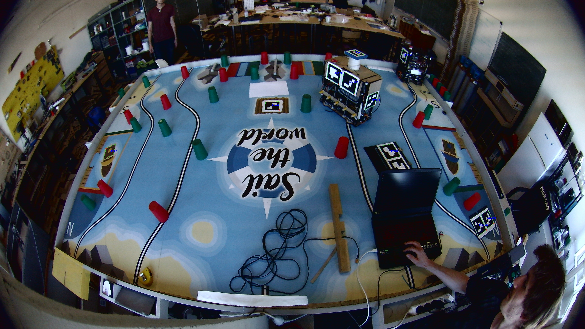
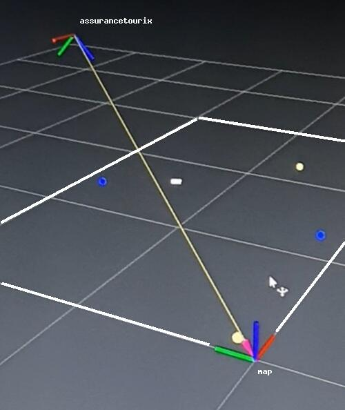
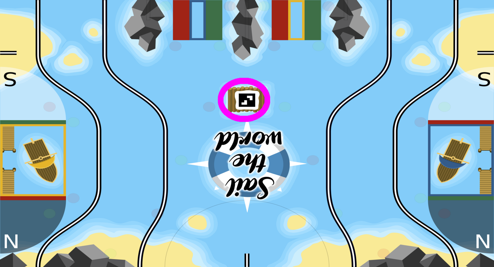

# Assurancetourix package

## What does this package do ?

### Camera mode :

- Fetches its settings from a yml file,
- Computes and publishes its static transformation relative to "map" frame (its frame is "assurancetourix"),
- Initialize a camera and automatically adjusting its exposure,
- Determines the side of the system (blue/yellow) and update it on the parameter server,
- Determines poses (positions/orientations) of allies and publish them on a topic named by "topic_for_allies_position" parameter in the yml configuration file,
- Determines positions of enemies and publish them on a topic named by "topic_for_gradient_layer" parameter in the yml configuration file,
- Determines whether the compass shows north or south and publish the result each 15 seconds on "/compass" topic,
- Can recover the configuration of the reef (the 5 color pattern).

### Simulation mode :

- Fetches its settings from a yml file,
- Extracts poses (positions/orientations) from webots of allies and publish them on a topic named by "topic_for_allies_position" parameter in the yml configuration file,
- Simulates a back and forth movement of an enemy in the middle of the table and publish it on a topic named by "topic_for_gradient_layer" parameter in the yml configuration file.

## Build it

In order to get the mode you want, you have to build this package by defining arguments during build:

### Camera mode :
`colcon build --packages-select assurancetourix --cmake-args=" -DCAMERA=ON"`

### Simulation mode :
`colcon build --packages-select assurancetourix --cmake-args=" -DSIMULATION=ON"`

# Brief explanation of used concepts

### Positioning :

In term of positioning, this package is based on this following *"simple"* concept:

**OpenCV library gives us the way to detect ArUco marker on a picture. The way OpenCV achieves this is detailed [here](https://docs.opencv.org/4.5.2/d5/dae/tutorial_aruco_detection.html). Knowing the size of an ArUco marker and camera intrinsic parameters, we can [approximate the marker position](https://docs.opencv.org/4.5.2/d9/d6a/group__aruco.html#ga84dd2e88f3e8c3255eb78e0f79571bd1) relative to the camera. Adding a bit of mathematical consideration described below, we can get a pretty accurate approximation of robots poses.**

 

### Color finding :

The way OpenCV compute position is way harder than the reverse consideration which is :
*Finding a pixel in the picture knowing camera intrinsic parameters and a given x, y, z position relative to the camera.*

In fact the difficult part of this is to understand mathematics models we are using in this package. We haven't been capable of finding a function in OpenCV that directly solves the problem, so we had to mathematically investigate how to achieve it. Don't worry I'll describe it later.

Knowing the pixel of interest, it's easy to get the color, indeed, an image (in OpenCV) is an array of array of unsigned char[3] such as [blue, green, red].

## Positioning

The basic concept of positioning explained, we can start diving into some more complex considerations.

Remember, in order to get an estimation positions of ArUco markers, we have to find camera intrinsic parameters. Luckily, I wrote for you a [complete guide](https://github.com/robotique-ecam/new_camera_calibration) to find those. This repository **isn't perfect**, maybe you'll have to modify a bit of some codes for it to achieve what you want, but overall, i think it's the **perfect way to introduce and understand** the different models involved.

*Disclaimer : for performance reasons, Assurancetourix package is written in cpp and not in python as in the "new_camera_calibration" repository.*

Now you've read "new_camera_calibration" repository, you understand a bit more about, what on the earth, are the pinhole and fisheye models.

But before continuing I want to describe a bit more about the link between the original image and the fisheye correction model image knowing camera intrinsic parameters of the fisheye model.

*Original image on the left, fisheye corrected model image **balanced** (balance 0.3) on the right*

 

If the image wasn't balanced (*balance 0.0*), it would have this appearance:

 

*(The picture isn't far away from the table from my perspective, that's why i had a little bit of balance.)*

In case you haven't understand what i want to describe, it's this following projection:
*I have a pixel from my original image that i want to transfer into my fisheye corrected image balanced.*

 

They're 2 steps to project a pixel from the original picture to the fisheye corrected and balanced one :
- First of all call the `cv::fisheye::undistortPoints` described in the [OpenCV documentation](https://docs.opencv.org/3.4/db/d58/group__calib3d__fisheye.html#gab738cdf90ceee97b2b52b0d0e7511541) .
- Then, you'll need a transformation matrix that apply this described balance (this matrix is returned by [this line](https://github.com/robotique-ecam/new_camera_calibration/blob/dd0f6d4a4a6e2ea9ae4b847f263cee3a2a607e0b/fisheye_model/fisheye_undistord.py#L49) in the script that undistort a fisheye picture in the *new_camera_calibration* repository). Having this matrix (I'll call it new_K), here's the equation to get the new pixel position:

 

### Camera settings

*How did we choose settings of the camera ?*
I'll assume you have a little background on how a camera works. We used a cool tools called [guvcview](https://doc.ubuntu-fr.org/guvcview) a very useful tool in which you can configure a bunch of options of you camera.

The principal difficulty was to **find a balance between motion blur and exposure time**. Keep in mind that we're capturing images of moving objects, that's not a problem if you're using a camera with a global shutter but they're way too expensive for us. That's why we're using a camera with an electronic rolling shutter.

If the exposure time if high, your image will be crystal clear in terms of colors (if other settings such as in the [yml parameters](https://github.com/robotique-ecam/cdfr/blob/0ad78d1e6dd02f59c0d3c98cf28d651a6cd22c88/src/assurancetourix/assurancetourix/param/assurancetourix.yml) file are correctly balanced), **but** you'll capture motion blur, so ArUco marker detection will not work as expected. In the opposite, if you set the exposure of the camera too low, for sure motion blur will not exist, **but** the picture will be way too dark for the ArUco marker detection to work as expected.

*An advice for you is to do some ArUco detection tests with settings that suits your camera and tweak them in order to have the lowest exposure time.*

**Now big problem :**
Ok that's cool, your settings are working great, but **only in your actual condition !** In fact the exposure setting is heavily dependent from the ambient light. We had to find a way to automatically configures it when starting Assurancetourix.

The solution is pretty simple:
- Put a white paper somewhere on the table (at known coordinates),
- Initialize the exposure value at a given start value,
- Check on the picture, at the white paper pixels, the BGR value,
	- If the average of the BGR value isn't high enough, raise the exposure,
	- If this average value is good enough, the time exposure is good enough, end of the auto-calibration.

 

If you pay attention at the exposure solution, you've noticed that I wrote about a way to find pixel from a given coordinate on the table. It's a bit early to discuss about it, but I will cover this topic a little later in this documentation.

### Get a position from a detected ArUco marker

Now it's time for you to understand how to find a pose (position, orientation) from a given ArUco marker that has been detected.

Reminder on our setup :
- Our camera is the [following](https://www.amazon.com/Camera-IMX317-Sensor-Windows-Android/dp/B08CV37Y2H?th=1): 4k camera, 170° fisheye lens, IMX317,
- It is used as central tracking system,
- Raspberry pi 4.

Here are steps to find the location of an ArUco marker (for our setup):
- [Step 1](https://github.com/robotique-ecam/cdfr/blob/0ad78d1e6dd02f59c0d3c98cf28d651a6cd22c88/src/assurancetourix/assurancetourix/src/assurancetourix.cpp#L298): Capture an image,
- [Step 2](https://github.com/robotique-ecam/cdfr/blob/0ad78d1e6dd02f59c0d3c98cf28d651a6cd22c88/src/assurancetourix/assurancetourix/src/assurancetourix.cpp#L424): Find the ArUco on this image, `cv::aruco::detectMarkers` gives us a vector of vector of Point2f (typically x,y of a pixel), each Point2f represents an edge of a detected marker. Plus we have a vector of ID of ArUco markers detected in the picture.
- [Step 3](https://github.com/robotique-ecam/cdfr/blob/0ad78d1e6dd02f59c0d3c98cf28d651a6cd22c88/src/assurancetourix/assurancetourix/src/assurancetourix.cpp#L400): Project all pixels of interest from the original picture to a space which represent the so called *fisheye corrected and balanced space* with the technique described in *the preamble*.
- [Step 4](https://github.com/robotique-ecam/cdfr/blob/0ad78d1e6dd02f59c0d3c98cf28d651a6cd22c88/src/assurancetourix/assurancetourix/src/assurancetourix.cpp#L504): Estimate poses of detected ArUco markers, knowing you've projected pixels of interest into a pinhole model, you can call `cv::aruco::estimatePoseSingleMarkers` with intrinsic parameters of your pinhole model. You get two vectors of vec3D representing the translation and orientation relative to the camera.

Of course that's a bit complex in terms of code because there's other stuff happening in the same time in our code. Such as the transformation of all markers from *assurancetourix* frame to a frame we're calling *map*, the estimation of robots poses extracted from all the poses of markers etc. This will be described later in the documentation.

Some details I think it's good for you to know:
- The accuracy of your positioning depends a lot of your camera models, **do not rush the model determination step** (described in "new_camera_calibration"). For example, with 400 pictures for determining the fisheye_model and another 400 pictures for the pinhole model, we achieved less than 1 cm accuracy near the camera and 3 cm accuracy in edges of the table,
- Read a lot of documentations about what you're using. By understanding what you are manipulating, it'll be a lot easier for you to understand what is going wrong,
- Tweak [parameters](https://docs.opencv.org/4.5.2/d1/dcd/structcv_1_1aruco_1_1DetectorParameters.html) of the ArUco detection, here's a pro tip: [corner refinement](https://github.com/robotique-ecam/cdfr/blob/0ad78d1e6dd02f59c0d3c98cf28d651a6cd22c88/src/assurancetourix/assurancetourix/src/assurancetourix.cpp#L39).

### Estimate the transformation of camera frame to map frame

At this point you know how to get poses of ArUco markers in your image relative to the camera frame. **But** the problem is that we don't want coordinates of ArUco markers relative to camera but relative to map instead. Here's a screenshot of rviz2 showing both frames assurancetourix and map, the arrow is what we're looking for: **the transformation between assurancetourix and map**.

 

*A transformation is a couple "translation/rotation" which convert a frame into another one.*

As a first approach, we were considering a static transformation, which is a **really bad idea** but we had to start somewhere. This was a bad idea because the slightest error in positioning the camera on the mast  will inevitably lead to a large error while computing poses of ArUco markers.

**How to compute the transformation between those frames ?**
By looking at the map, you'll see something really interesting in the middle of it. There is an ArUco marker waiting for us to be used.

 

Remember, you know how to get poses of ArUco markers relative to camera. With the pose of this center ArUco in the camera frame and by knowing the pose of this marker in the map frame (x=1.5, y=0.75). So, mathematically there's a way to find the transformation between assurancetourix and map frames.

Here are steps to find this transformation:
- [Step 1](https://github.com/robotique-ecam/cdfr/blob/22f4b346f28eda8f42e1db540ca941e9027e4f86/src/assurancetourix/assurancetourix/src/assurancetourix.cpp#L174): Capture a bunch of images, apply the algorithm to detect and estimate ArUco poses and average poses (it'll works for one image but a lot of them will increase the precision of the pose),
- [Step 2](https://github.com/robotique-ecam/cdfr/blob/22f4b346f28eda8f42e1db540ca941e9027e4f86/src/assurancetourix/assurancetourix/src/assurancetourix.cpp#L208): Inverse this pose in order to get the camera frame relative to the center marker frame,
-  [Step 3](https://github.com/robotique-ecam/cdfr/blob/22f4b346f28eda8f42e1db540ca941e9027e4f86/src/assurancetourix/assurancetourix/src/assurancetourix.cpp#L215): Now we have camera relative to center marker and center marker relative to map, we can compute camera relative to map i.e. the transformation between assurancetourix and map frames.

You might get a little concerned about all those transformations stuff. Indeed the mathematical consideration is fully blurred transformation wise because we’re using  *[geometry2](https://github.com/ros2/geometry2/tree/galactic)* ros2 package which contains all we need about transformations. The idea is simple, people who made this package optimized it, by using it there will be a lot less errors than if we wrote by hand all equations.

**I highly recommend** you to get a look at the [tf2_kdl](https://github.com/ros2/geometry2/blob/foxy/tf2_kdl/include/tf2_kdl/tf2_kdl.h) library which is quite easy to understand and use transformations wise.
