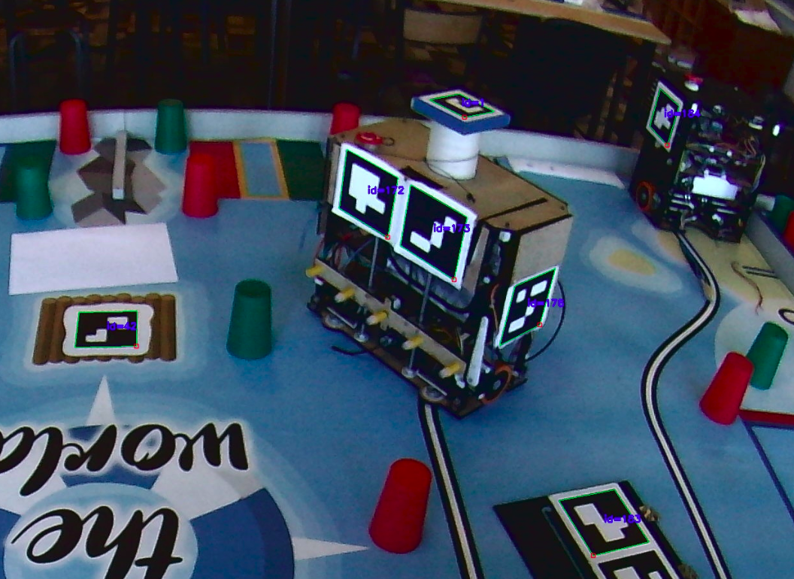
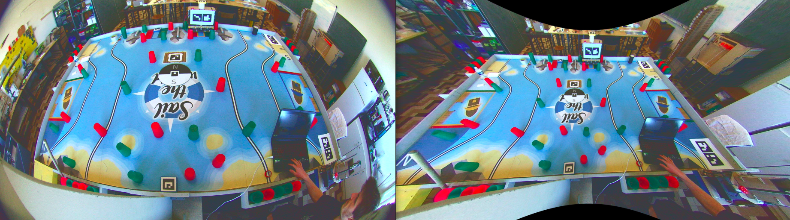
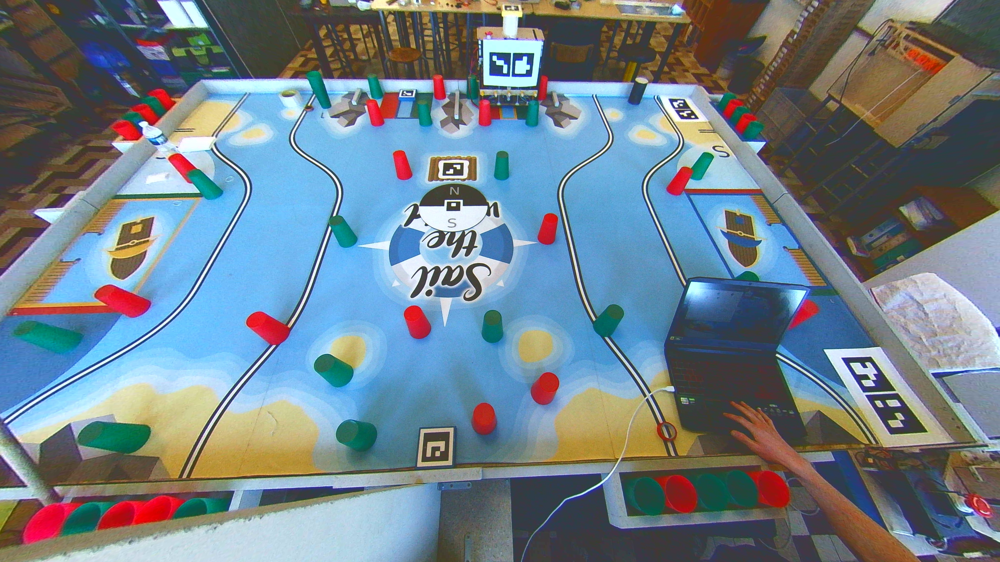
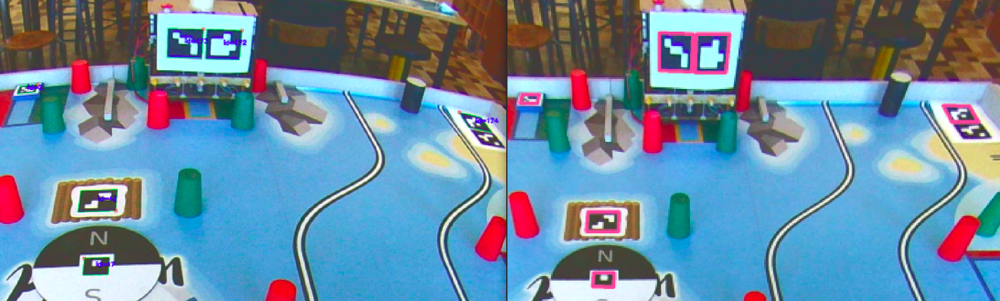
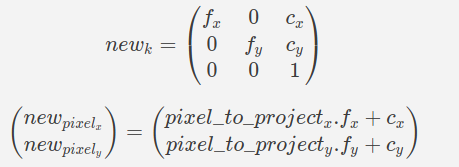

# Assurancetourix package

## What does this package do ?

### Camera mode :

- Fetches its settings from a yml file,
- Computes and publishes its static transformation relative to "map" frame (its frame is "assurancetourix"),
- Initialize a camera and automatically adjusting its exposure,
- Determines the side of the system (blue/yellow) and update it on the parameter server,
- Determines poses (positions/orientations) of allies and publish them on a topic named by "topic_for_allies_position" parameter in the yml configuration file,
- Determines positions of enemies and publish them on a topic named by "topic_for_gradient_layer" parameter in the yml configuration file,
- Determines whether the compass shows north or south and publish the result each 15 seconds on "/compass" topic,
- Can recover the configuration of the reef (the 5 color pattern).

### Simulation mode :

- Fetches its settings from a yml file,
- Determines poses (positions/orientations) of allies and publish them on a topic named by "topic_for_allies_position" parameter in the yml configuration file,
- Simulates a back and forth movement of an enemy in the middle of the table and publish it on a topic named by "topic_for_gradient_layer" parameter in the yml configuration file.

## Build it

In order to get the mode you want, you have to build this package by defining arguments during build:

### Camera mode :
`colcon build --packages-select assurancetourix --cmake-args=" -DCAMERA=ON"`

### Simulation mode :
`colcon build --packages-select assurancetourix --cmake-args=" -DSIMULATION=ON"`

# Explanation of used concepts

In term of positioning, this package is based on this following *"simple"* concept:

**OpenCV library gives us the way to detect ArUco marker on a picture. The way OpenCV achieves this is detailed [here](https://docs.opencv.org/4.5.2/d5/dae/tutorial_aruco_detection.html). Knowing the size of an ArUco marker and camera intrinsic parameters, we can [approximate the marker position](https://docs.opencv.org/4.5.2/d9/d6a/group__aruco.html#ga84dd2e88f3e8c3255eb78e0f79571bd1) relative to the camera. Adding a bit of mathematical consideration described below, we can get a pretty accurate approximation of robots poses.**

 

### Color finding :

The way OpenCV compute position is way harder than the reverse consideration which is :
*Finding a pixel in the picture knowing camera intrinsic parameters and a given x, y, z position relative to the camera.*

In fact the difficult part of this is to understand the mathematics models we are using in this package. We haven't been capable of finding a function in OpenCV that directly solves the problem, so we had to mathematically investigate how to achieve it. Don't worry I'll describe it later.

Knowing the pixel of interest, it's easy to get the color, indeed, an image (in OpenCV) is an array of array of unsigned char[3] such as [blue, green, red].

## Positioning

The basic concept of positioning explained, we can start diving into some more complex considerations.

Remember, in order to get an estimation of the position of ArUco markers, we have to find camera intrinsic parameters. Luckily, I wrote for you a [complete guide](https://github.com/robotique-ecam/new_camera_calibration) to find those. This repository **isn't perfect**, maybe you'll have to modify a bit of some codes for it to achieve what you want, but overall, i think it's the **perfect way to introduce and understand** the different models involved.

*Disclaimer : for performance reasons, Assurancetourix package is written in cpp and not in python as in the "new_camera_calibration" repository.*

Now you've read "new_camera_calibration" repository, you understand a bit more about, what on the earth, are the pinhole and fisheye models.

But before continuing I want to describe a bit more about the link between the original image and the fisheye correction model image knowing camera intrinsic parameters of the fisheye model.

*Original image on the left, fisheye corrected model image **balanced** (balance 0.3) on the right*

 

If the image wasn't balanced (*balance 0.0*), it would have this appearance:

 

*(The picture isn't far away from the table from my perspective, that's why i had a little bit of balance.)*

In case you haven't understand what i want to describe, it's this following projection:
*I have a pixel from my original image that i want to transfer into my fisheye corrected image balanced.*

 

They're 2 steps to project a pixel from the original picture to the fisheye corrected and balanced one :
- First of all call the `cv::fisheye::undistortPoints` described in the [OpenCV documentation](https://docs.opencv.org/3.4/db/d58/group__calib3d__fisheye.html#gab738cdf90ceee97b2b52b0d0e7511541) .
- Then, you'll need a transformation matrix that apply this described balance (this matrix is returned by [this line](https://github.com/robotique-ecam/new_camera_calibration/blob/dd0f6d4a4a6e2ea9ae4b847f263cee3a2a607e0b/fisheye_model/fisheye_undistord.py#L49) in the script that undistort a fisheye picture in the *new_camera_calibration* repository). Having this matrix (I'll call it new_K), here's the equation to get the new pixel position:

 
