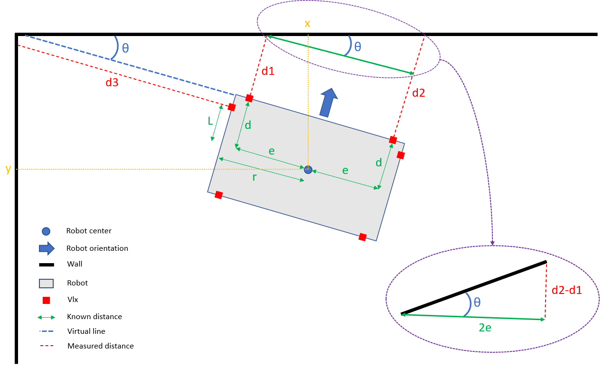
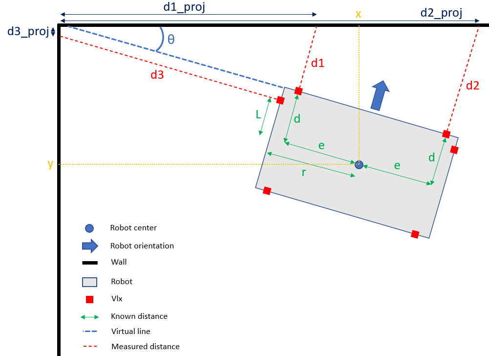

# Localisation package

## What does this package do ?

- Publish the initial map->odom transformation,
- Subscribe to "odom" topic and publish on "odom_map_relative" the map relative robot pose,
- Compute the transformation to re-adjust odometry and publish it.

## Odometry re-adjustement method

In order to re-adjust the odometry, 2 things are used:
- Vision from assurancetourix package,
- 6 VL53L1X around the robot.

### Vision

Assurancetourix is publishing aruco positions and orientation through /allies_positions_markers topic. By subscribing to the topic and identify the marker that correspond to the node's namespace, the position and orientation of the robot can be found.

### VL53L1X

There are 6 VL53L1X on the robot, by knowing there positions relative to the robot and by getting the distance they're returning, with a certain amount of mathematical considerations (described below), the position and orientation of the robot can re found.

The limitation of this algorithm is that **we do have to know an estimation of the position and orientation of the robot to validate and refine the pose (position/orientation).**

### Problem raised by a mix of vision and VLX

We're estimating the vision localization precision of about 1 centimeter average which isn't enough in some cases (particularly near walls).

So, in order to increase the precision, the information given by the vision needs to be refined by a vlx measure. But keep in mind that vision gives a pose STAMPED information which means the marker given by assurancetourix has a delay of a few milliseconds (~350ms average). The vlx measure takes (in simulation) about 60ms which gives a final difference between theses stamps of about 400ms.

If the robot is moving at something like 20cm/s, we do have to allow a difference of 8cm between the vision pose and vlx computed pose. Unrealistic, goblet have a 7cm diameter.

If you haven't understood yet what the problem is, here it is: **the difference of stamps between vlx measure and vision measure must be as small as possible.**

### Another approach

We do know that every 750ms we're gonna try to re-adjust odometry by allowing the node to receive a marker information. A routine can be thought that waits for 0.65s, launch a loop getting the vlx measures and stamp of the sample and storing them in a queue of something like 10 samples ( I add a small delay between each sample to avoid overloading the localisation_node thread ) . The older element of this queue is 600ms old, it's easy to retrieve the nearest element of the queue from the vision marker stamp. When retrieving this element, the vlx sample thread is stopped.

With this nearest queue element, we have a maximum difference of stamps of 0.04ms which is 10 times better than the previous approach. We're going to consider that's enough of an optimization.

We now just have to compare the vlx computed pose and vision pose of the robot, if those are really near ( < 5cm, <0.1rad ) and the estimated projection of vlx on the walls are effectively on the right wall, we're considering the correction as valid. The valid transformation is sent to drive for it to re-adjust odometry. If the vlx computed pose isn't considered as valid, the vision pose is sent to drive.

After sending the correction transformation to drive, we have to restart the vlx sample thread with a starting delay of 0.65 seconds.

### Near walls routine

There's a specific behavior of this package near walls: in the odom callback, while detecting the robot position being near walls (<30cm from a wall), the node short circuit the behavior previously presented and adopt a new strategy.

This strategy consider an "infinite" sampling of the vlx sampling thread with no starting delay. Each 0.5 seconds odom callback, the node ask for an odometry re-adjustment considering the last robot pose that sent drive.

As previously, there's a comparison between stamps to get the nearest one of the queue that gives the sample to consider for calculation. When calculating the new pose from the vlx distance values, the thread is stopped avoid overloading of the localisation_node thread.

If the computed pose is considered as valid, it's sent to drive to re-adjust odometry. Else the pose is just thrown away and nothing is sent to re-adjust odometry.

Then, the vlx sampling thread is restarted with no delay because the node can continues trying to readjust odometry with vision callback with the strategy described in the previous paragraph.

### Avoiding concurrency problems

You've understood it, the localisation node contains several threads (odom callback, marker callback and vlx sample). In order to avoid concurrency problems (especially deadlocks, several thread starting, overloading etc.) several strategies are deployed:
- **Deadlocks:**
 The resources shared by several threads can be writable only in one thread, in other threads, this resources is only readable.
 - **Several thread starting:**
Only one vlx sampling thread can be started, when asking for the creation of this thread, there's a check of this existing thread before creating it or raising that this thread is already running. Same thing for stopping this thread, if no vlx sampling thread is existing, the node raising that this thread doesn't exist.
- **Overloading:**
Getting vlx values is a blocking call, so there's a need of a small non-blocking delay between each sample that allow the node doing its other works.

## Mathematical considerations

This paragraph is about to explain you how we can compute the pose (position/orientation) of the robot from the vlx measured distances.

As all geometrical problem it's way easier to understand what's happening with a schematic of the situation:

 

Now, time to deep dive into calculations:

+ =(x,y,\theta))
	+ :\
Considering the triangle surrounded in purple and basic trigonometric formula:\
=\frac{d2-d1}{2e})\
%20)

	+  and :\
Now that we now , it's fairly simple to get x and y by projecting vlx distances using it.

 

.\cos{\theta}}%20\%20(1))\
.\cos{\theta}%2BL.\sin{\theta}}\%20(2))

+ =(d1,d2,d3))
	+ \
\Rightarrow\tan{\theta}=\frac{d2-d1}{2e})\
%20)\
\Rightarrow\y=(\frac{d1%2B(d1%2B2e\tan{\theta})}{2}%2Bd).\cos{\theta})\
.\cos{\theta})\

	+ \
\Rightarrow\d2=2e\tan{\theta}%2B\frac{y}{\cos{\theta}}-e\tan{\theta}-d)\

	+ \
\Rightarrow\x-L.\sin{\theta}=(d3%2Br).\cos{\theta})\
\

+ =(d1\_proj,d2\_proj,d3\_proj))\

 
All theses are just simple projection knowing  and =(d1,d2,d3)). It constitutes an extra tool to validate the pose estimation. Indeed, if a projection is negative, it's because the vlx doesn't measure the distance to the desired wall, so the resulting pose will obviously be incorrect.
.\sin{\theta}-e.\cos{\theta}})\
.\sin{\theta}%2Be.\cos{\theta}})\
.\sin{\theta}-L.\cos{\theta}})

### Formulas summary
\
.\cos{\theta}%2BL.\sin{\theta}}\%20)\
.\cos{\theta}})\
%20)\
\
\

\
\
.\sin{\theta}-e.\cos{\theta}})\
.\sin{\theta}%2Be.\cos{\theta}})\
.\sin{\theta}-L.\cos{\theta}})
