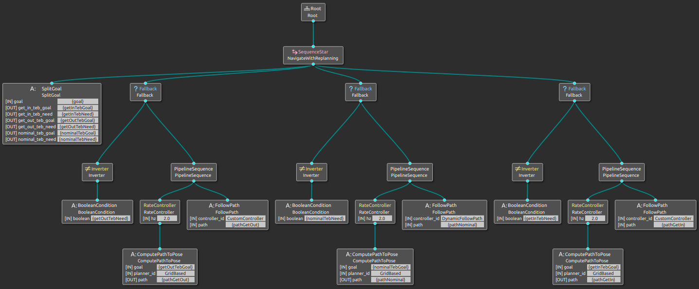

## Custom behavior tree plugins

In this folder you can find 2 nav2 bt plugins :
- bt_boolean_condition
- bt_split_goal

The purpose of theses custom plugins is to choose between 2 different TEB controllers depending on the pose (position/orientation) of the goal in input. The final goal is for the robot to move linearly and as much perpandicular to the wall as possible in specific area (by specific area i mean near walls and in ports).

#### bt_boolean_condition

This plugin is just a naïve SUCCESS / FAILURE sender depending on the input boolean. It's the perfect example for knowing how a bt_plugin works and how to implement it. Can easily be replaced by an ifThenElse native Control node from behaviortree_cpp_v3.

#### bt_split_goal

This is the brain node of the BT, here's what it does :
+ Gets the objective **"goal"** as a PoseStamped (when action send_goal)
+ Determines if the user choose to force the use of a controller :
  + z = 0.0 for automatic
  + z = 1.0 for speed and not that precise controller
  + z = 2.0 for a slow and precise controller
+ Compute 3 booleans **get_out_teb_need**, **nominal_teb_need**, **get_in_teb_need** :
  + get_out_teb_need : If getting out of a specific area is needed (near walls, in ports)
  + nominal_teb_need : If the nominal controller is needed
  + get_in_teb_need : If the goal is in a specific area (near walls, in ports)
+ Depending on theses parameters, this bt node can compute **get_out_teb_goal**, **nominal_teb_goal**, **get_in_teb_goal** and send them to the BT

## The navigation behavior tree

The navigation BT can be found [here](../../modules/robot/behavior_trees/navigate_w_replanning_time.xml) and looks like this :

 
